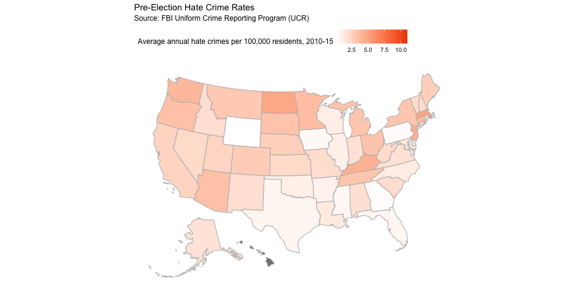
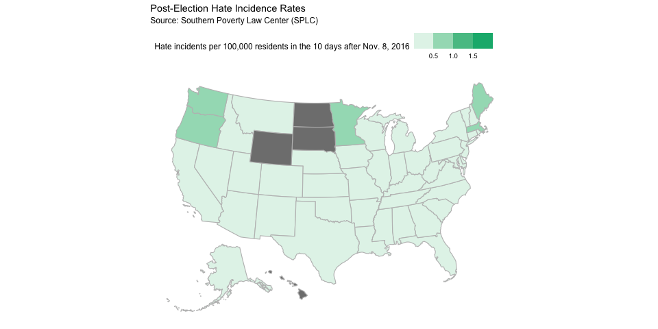

# BST 270: Individual Project
Nikhil Vytla

## Introduction

The following notebook aims to satisfy the requirements for the
individual project component of BST 270: Reproducible Data Science,
taken Winter 2024.

#### Motivations and Reproducibility

My aim is to reproduce two figures from FiveThirtyEight’s [Higher Rates
Of Hate Crimes Are Tied To Income
Inequality](https://fivethirtyeight.com/features/higher-rates-of-hate-crimes-are-tied-to-income-inequality/).

Specifically, I aim to reproduce the two provided geographic plots on
pre- and post-election hate crime rates. I will utilize the provided
dataset based on FBI and SPLC survey data on hate crimes, located at
`../data/hate_crimes.csv`.

## Setup

First, we load our required packages and required dataset. We utilize
the `usmap` library to easily plot U.S.-based geographic data, which our
CSV file is compatible with. We utilize the `ggplot2` library to add
additional graphical customization to our plot (e.g. titles, custom
scales, fills, colors, etc.).

We directly download and read the CSV file from FiveThirtyEight’s
official GitHub repository:
[fivethirtyeight/data/hate-crimes](https://github.com/fivethirtyeight/data/tree/master/hate-crimes).

> NOTE: Alternatively, there is an [unofficially published R package
> named
> fivethirtyeight](https://cran.r-project.org/web/packages/fivethirtyeight/vignettes/fivethirtyeight.html)
> that provides easy access to FiveThirtyEight’s GitHub-published
> datasets.

<details>
<summary>Code</summary>

``` r
library(usmap)
library(ggplot2)

hate_crimes_data <- read.csv("https://raw.githubusercontent.com/fivethirtyeight/data/master/hate-crimes/hate_crimes.csv")
write.csv(hate_crimes_data, file='../data/hate_crimes.csv', quote=FALSE, row.names = FALSE)
```

</details>

## Reproducing Plots

### Figure 1: Plot pre-election hate crime rates

The first figure plots pre-election hate crime rates per 100,000
residents between 2010-2015 per data sourced from the FBI Uniform Crime
Reporting Program.

<details>
<summary>Code</summary>

``` r
plot_usmap(data = hate_crimes_data, values = "avg_hatecrimes_per_100k_fbi", color = "grey") + 
  scale_fill_continuous(name = "Average annual hate crimes per 100,000 residents, 2010-15", label = scales::comma, low = "white", high = "#ed4900") + 
  theme(legend.position = "top") +
  labs(title = "Pre-Election Hate Crime Rates",
       subtitle = "Source: FBI Uniform Crime Reporting Program (UCR)")
```

</details>



### Figure 2: Plot post-election hate incidence rates

The second figure plots post-election hate incidence rates per 100,000
residents in the 10 days after November 8, 2016, as reported by SPLC.

<details>
<summary>Code</summary>

``` r
plot_usmap(data = hate_crimes_data, values = "hate_crimes_per_100k_splc", color = "grey") + 
  scale_fill_binned(name = "Hate incidents per 100,000 residents in the 10 days after Nov. 8, 2016", label = scales::comma, low = "#ffffff", high = "#00b37b") + 
  theme(legend.position = "top") +
  labs(title = "Post-Election Hate Incidence Rates",
       subtitle = "Source: Southern Poverty Law Center (SPLC)")
```

</details>



## Limitations and Biases

The author mentions the following biases in the original data sources
used:

> “The federal government doesn’t track hate crimes systematically
> (agencies report to the FBI voluntarily), and the Southern Poverty Law
> Center uses media accounts and people’s self-reports to assess the
> situation. Moreover, FBI hate crimes data for 2016 won’t be released
> for another several months, and the Southern Poverty Law Center didn’t
> collect data before the 2016 election. However, both data sources are
> publicly available and easy to navigate, which means they’re some of
> the best we have.
>
> But they also have biases baked in.
>
> The FBI [Uniform Crime Reporting Program](https://ucr.fbi.gov/)
> collects hate crime data from law enforcement agencies. But because
> the data is submitted voluntarily, it’s unclear how comprehensive the
> data set is. We don’t have data from Hawaii, for instance. Moreover,
> the UCR Program collects data on only prosecutable hate *crimes*,
> which make up a fraction of hate *incidents* (which includes
> non-prosecutable offenses, such as circulation of [white nationalist
> recruitment
> materials](http://www.scpr.org/news/2016/11/16/66172/ucla-quickly-removes-white-nationalist-fliers-from/)
> on college campuses).
>
> On the other hand, the Southern Poverty Law Center data — which comes
> from a combination of curated media accounts and self-reported form
> entries — includes both hate *crimes* and non-prosecutable hate
> *incidents*. Moreover, heightened news coverage of hate incidents
> after the election may have encouraged people to report incidents that
> they would not have otherwise reported. This is called awareness bias
> — a trend that is well-established in epidemiology, [environmental
> health](http://journals.lww.com/epidem/Abstract/2000/03000/An_Exploration_of_Awareness_Bias_in_Two.20.aspx)
> and other fields of research that frequently use self-reported data.”
